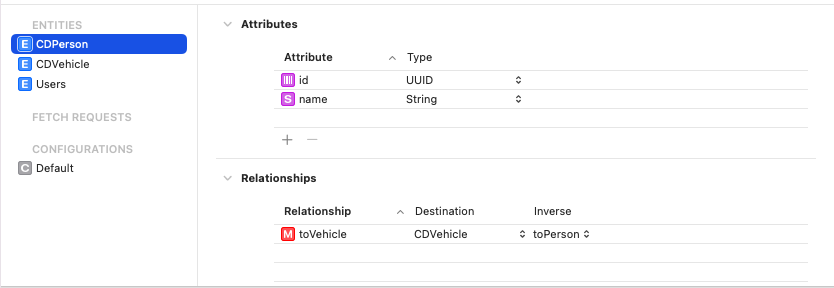

# CoreDataRelationship

In this example I have created releationship between CDPerson and CDVehicle entities. 

CDPerson entity

CDVehicle entity

This example will help you to create relationship in coredata.
